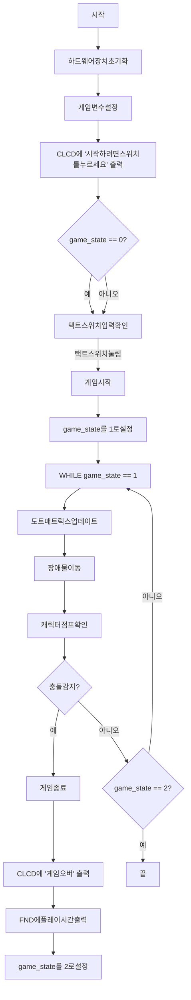

# 프로젝트 개요
본 IOT 프로젝트는 임베디드 시스템을 활용하여 점프 게임을 개발하는 것을 목표로 합니다.  
이 게임은 플레이어가 캐릭터를 조작하여 다가오는 장애물을 피하고 최대한 오래 살아남는 것이 목표입니다.  
게임은 Dot Matrix에 캐릭터와 장애물이 표시되며, CLCD에는 게임 상태와 게임 오버 메시지가 출력됩니다.  
플레이어는 Tact Switch를 사용하여 캐릭터를 점프시켜 장애물을 피할 수 있습니다.  
게임 속도는 Dip Switch를 통해 조절할 수 있으며, 게임 종료 시 FND에 플레이 시간이 표시됩니다.

## 개발 기간
> 2024.05 ~ 2024.06

## 팀원 소개
[김혜민](https://github.com/minixzip)
[심영민](https://github.com/zeromin41)
[정재형](https://github.com/jaehyeongjung)
[전하라](https://github.com/rarabong)

## 사용 개발 환경

  
  
  
  
  

# 플로우차트

# 프로젝트 계획

<h2>
  1주차 프로젝트 계획
</h2>

  

<h2>
  2주차 프로젝트 계획
</h2>

<h2>
  3주차 프로젝트 계획
</h2>

<h2>
  4주차 프로젝트 계획
</h2>

<h2>
  5주차 프로젝트 최종 발표
</h2>

# 프로젝트 시연 영상
[시연 영상 유튜브 링크](https://www.youtube.com/watch?v=nFt3l6eh_fw)
## 프로젝트 주요 화면

